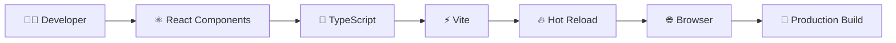
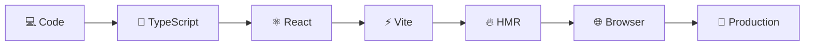
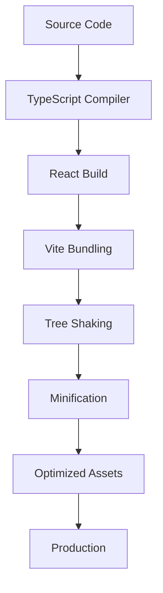

<div align="center">


# ⚛️ React + TypeScript + Vite

### 🚀 Lightning Fast • 📘 Type Safe • ⚡ Instant HMR • 🛡 Oxlint Powered

<p>


</p>


</div>

---

# 🚀 Modern Frontend Ecosystem

<div align="center">



</div>

---

# 🎯 Technology Stack

| Technology | Purpose | Logo |
|------------|----------|------|
| React | UI Development |  |
| TypeScript | Static Typing |  |
| Vite | Fast Bundler |  |
| Node.js | Runtime |  |
| NPM | Package Manager |  |

---

# 🏗 Project Architecture

<div align="center">

```text
                           🌐 USER
                              │
                              ▼
                 ┌────────────────────────┐
                 │    React Components    │
                 └────────────┬───────────┘
                              │
                 ┌────────────▼───────────┐
                 │    TypeScript Logic    │
                 └────────────┬───────────┘
                              │
                 ┌────────────▼───────────┐
                 │    State Management    │
                 └────────────┬───────────┘
                              │
                 ┌────────────▼───────────┐
                 │      Vite Server       │
                 └────────────┬───────────┘
                              │
                 ┌────────────▼───────────┐
                 │     Hot Module Reload  │
                 └────────────┬───────────┘
                              │
                              ▼
                     ⚡ Browser Output
```

</div>

---

# 📦 Project Structure

```text
📦 Project
│
├── 📂 public
│
├── 📂 src
│   ├── 📂 assets
│   ├── 📂 components
│   ├── 📂 hooks
│   ├── 📂 layouts
│   ├── 📂 pages
│   ├── 📂 services
│   ├── 📂 utils
│   ├── 📂 styles
│   ├── App.tsx
│   └── main.tsx
│
├── package.json
├── tsconfig.json
├── vite.config.ts
├── eslint.config.js
└── README.md
```

---

# ⚡ Development Workflow

<div align="center">



</div>

---

# ✨ Core Features

| 🚀 Feature | Description |
|------------|-------------|
| ⚛ React 19 | Latest Component Architecture |
| 📘 TypeScript | Strong Static Typing |
| ⚡ Vite | Ultra Fast Development Server |
| 🔥 HMR | Instant Live Reload |
| 📦 Optimized Build | Production Ready |
| 🛡 Oxlint | Lightning Fast Linting |
| 🌙 Modern UI | Ready for Responsive Projects |
| 📱 Mobile Friendly | Works Across All Devices |

---

# 📊 Performance Pipeline

<div align="center">



</div>

---

# 🎨 Visual Stack

<div align="center">


</div>

---

# 📈 Why Vite?

<div align="center">

| Traditional Bundlers | ⚡ Vite |
|----------------------|---------|
| 🐢 Slow Startup | 🚀 Instant Startup |
| 🐢 Slow Refresh | ⚡ HMR |
| 🐢 Heavy Bundling | 📦 Native ES Modules |
| 🐢 Longer Builds | ⚡ Optimized Builds |

</div>

---

<div align="center">

### ⭐ Star this repository if you found it useful!


</div>
