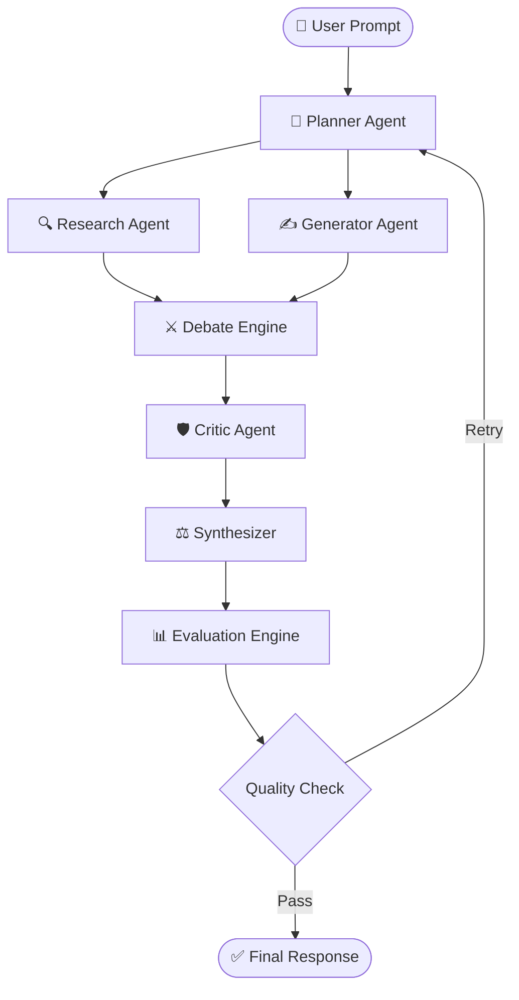
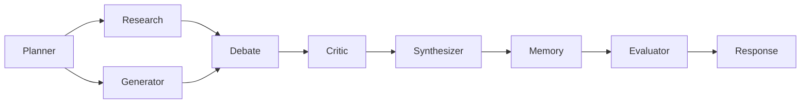
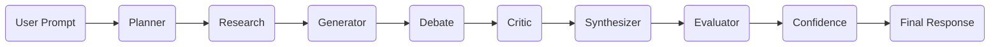

<div align="center">


<br>


<br><br>


<br><br>


</div>

---

# 🧠 Adversaria AI

> **A Production-Grade Adversarial Multi-Agent AI Platform**

Adversaria AI is an advanced AI orchestration platform where multiple intelligent agents collaborate, debate, criticize, and synthesize responses before delivering a final answer.

Instead of relying on a single LLM response, Adversaria AI introduces a **Debate-Driven Multi-Agent Architecture** that significantly improves reasoning quality, reduces hallucinations, and provides explainable AI decisions.

---

## 🌟 Highlights

- 🤖 Multi-Agent Collaboration
- ⚔️ Debate Driven Reasoning
- 🧠 Dynamic Agent Spawning
- 📊 Explainable AI (XAI)
- 📚 Long-Term Memory
- ⚡ Real-Time Streaming
- 🔍 Retrieval-Augmented Generation
- 🏗 Modular Agent Framework
- 📈 Evaluation Dashboard
- ☁ Production Ready

---

## 📊 Repository Stats

<p align="center">


</p>

<p align="center">


</p>

---

## 💻 Technology Stack

<p align="center">


</p>

---

## ✨ Core Features

| Feature | Description |
|----------|-------------|
| 🤖 Multi-Agent | Multiple specialized AI agents collaborate |
| ⚔ Debate Engine | Agents challenge each other's reasoning |
| 🧠 Planner | Breaks complex prompts into tasks |
| 🔍 Research | Collects supporting evidence |
| ✍ Generator | Produces candidate responses |
| 🛡 Critic | Detects flaws and hallucinations |
| ⚖ Synthesizer | Combines the strongest ideas |
| 📊 Evaluator | Scores response quality |
| 📚 Memory | Long-term contextual knowledge |
| ⚡ Streaming | Live reasoning visualization |

---
<div align="center">

# 🏗️ System Architecture


</div>

---

## 🧠 High-Level Workflow



---

# 🤖 Multi-Agent Pipeline



---

# ⚔️ Debate Driven Reasoning

Traditional AI

```
Prompt
   │
   ▼
Single LLM
   │
   ▼
Answer
```

---

Adversaria AI

```
Prompt
   │
   ▼
Planner
   │
   ├────────────┐
   ▼            ▼
Research    Generator
   │            │
   └─────┬──────┘
         ▼
 Debate Engine
         │
         ▼
 Critic Agent
         │
         ▼
 Synthesizer
         │
         ▼
 Evaluation
         │
         ▼
 Final Response
```

---

# 🧩 Agent Responsibilities

| Agent | Responsibility |
|--------|----------------|
| 🧠 Planner | Breaks prompts into subtasks |
| 🔍 Research | Retrieves relevant knowledge |
| ✍️ Generator | Produces candidate answers |
| ⚔️ Debate | Challenges assumptions |
| 🛡️ Critic | Finds hallucinations and logical flaws |
| ⚖️ Synthesizer | Combines the strongest arguments |
| 📊 Evaluator | Measures confidence and quality |
| 📚 Memory | Maintains long-term context |

---

# 📂 Project Structure

```text
Adversaria-AI/
│
├── backend/
│   ├── app/
│   │   ├── api/
│   │   ├── agents/
│   │   ├── memory/
│   │   ├── prompts/
│   │   ├── services/
│   │   ├── utils/
│   │   ├── models/
│   │   ├── schemas/
│   │   ├── evaluation/
│   │   └── main.py
│   │
│   ├── tests/
│   ├── requirements.txt
│   └── Dockerfile
│
├── frontend/
│   ├── public/
│   ├── src/
│   │   ├── assets/
│   │   ├── pages/
│   │   ├── components/
│   │   ├── hooks/
│   │   ├── services/
│   │   ├── context/
│   │   ├── layouts/
│   │   ├── styles/
│   │   ├── App.tsx
│   │   └── main.tsx
│   │
│   ├── package.json
│   └── vite.config.ts
│
├── docs/
├── screenshots/
├── docker-compose.yml
├── README.md
└── LICENSE
```

---

# 🚀 Request Processing Pipeline

```
User Prompt
      │
      ▼
Prompt Analysis
      │
      ▼
Task Planning
      │
      ▼
Knowledge Retrieval
      │
      ▼
Response Generation
      │
      ▼
Debate Phase
      │
      ▼
Critique
      │
      ▼
Synthesis
      │
      ▼
Evaluation
      │
      ▼
Streaming Response
```

---

# 🧠 Explainable AI

Every generated response contains:

- ✅ Agent reasoning
- 📚 Supporting evidence
- ⚔️ Counter arguments
- 📊 Confidence score
- 🔍 Evaluation metrics
- 🧩 Decision path
- 📈 Quality score
- 🛡️ Hallucination detection

---

<div align="center">

## ⚡ Intelligent Agent Collaboration

> "Better decisions emerge when multiple intelligent agents challenge, critique, and improve each other's reasoning."

</div>

---
<div align="center">


# ⚙️ Installation & Quick Start

</div>

---

# 📋 Prerequisites

Before getting started, ensure you have the following installed:

| Software | Version |
|-----------|---------|
| Python | 3.11+ |
| Node.js | 20+ |
| npm | Latest |
| Git | Latest |
| Docker | Optional |
| Qdrant | Latest |

---

# 📥 Clone Repository

```bash
git clone https://github.com/kriss2012/Adversaria-AI.git

cd Adversaria-AI
```

---

# 🐍 Backend Setup

Create a virtual environment

```bash
python -m venv .venv
```

Activate

### Windows

```bash
.venv\Scripts\activate
```

### Linux / macOS

```bash
source .venv/bin/activate
```

Install dependencies

```bash
pip install -r requirements.txt
```

---

# 🌐 Frontend Setup

```bash
cd frontend

npm install
```

or

```bash
yarn
```

---

# 🔐 Environment Variables

Create a `.env` file inside the backend directory.

```env
OPENAI_API_KEY=your_api_key

ANTHROPIC_API_KEY=your_api_key

GOOGLE_API_KEY=your_api_key

QDRANT_URL=http://localhost:6333

QDRANT_API_KEY=

DATABASE_URL=sqlite:///adversaria.db

SECRET_KEY=change_this_secret

MODEL=gpt-4o

DEBUG=True
```

---

# 🚀 Start Backend

```bash
uvicorn app.main:app --reload
```

Server

```
http://localhost:8000
```

Swagger Docs

```
http://localhost:8000/docs
```

ReDoc

```
http://localhost:8000/redoc
```

---

# 🎨 Start Frontend

```bash
npm run dev
```

Application

```
http://localhost:5173
```

---

# 🐳 Docker Deployment

Build

```bash
docker-compose build
```

Run

```bash
docker-compose up
```

Detached

```bash
docker-compose up -d
```

Stop

```bash
docker-compose down
```

---

# 📡 API Endpoints

## Generate Response

```
POST /api/v1/chat
```

Example

```json
{
  "prompt":"Explain Quantum Computing"
}
```

---

## Agent Status

```
GET /api/v1/agents
```

---

## Health

```
GET /health
```

---

## Memory

```
POST /api/v1/memory
```

---

## Evaluation

```
POST /api/v1/evaluate
```

---

## Streaming

```
GET /api/v1/stream
```

---

# ⚡ Streaming Response

The platform supports

- Server Sent Events

- Live Token Streaming

- Real-time Debate

- Progressive Rendering

- Agent Activity Updates

---

# 💻 Example Python Client

```python
import requests

response = requests.post(
    "http://localhost:8000/api/v1/chat",
    json={
        "prompt":"Explain Artificial Intelligence"
    }
)

print(response.json())
```

---

# 💻 Example JavaScript Client

```javascript
const response = await fetch("/api/v1/chat",{
method:"POST",
headers:{
"Content-Type":"application/json"
},
body:JSON.stringify({
prompt:"Explain AI"
})
})

const data=await response.json()

console.log(data)
```

---

# 📦 Technologies Used

| Backend | Frontend | AI | Database |
|----------|----------|----|----------|
| FastAPI | React | LangGraph | Qdrant |
| Python | TypeScript | OpenAI | SQLite |
| Uvicorn | Vite | Anthropic | PostgreSQL |
| Pydantic | TailwindCSS | Gemini | Redis |

---

# 🔥 Performance

✅ Multi-Agent Execution

✅ Parallel Reasoning

✅ Async FastAPI

✅ Vector Search

✅ Explainable AI

✅ Response Evaluation

✅ Live Streaming

✅ Scalable Architecture

---

<div align="center">

## 🚀 Ready to Build Smarter AI Systems

Powering the next generation of collaborative intelligence through adversarial reasoning and explainable multi-agent workflows.

</div>

---
<div align="center">


</div>

---

# ✨ Advanced Features

<table>
<tr>
<td width="33%" align="center">

## 🤖 Multi-Agent AI

Planner Agent

Research Agent

Generator Agent

Critic Agent

Debate Agent

Synthesizer

Memory Agent

Evaluator

</td>

<td width="33%" align="center">

## ⚔ Debate Engine

Autonomous Critique

Counter Arguments

Fact Verification

Reasoning Comparison

Voting Strategy

Consensus Building

</td>

<td width="33%" align="center">

## 📊 Explainable AI

Confidence Score

Decision Trace

Evidence Chain

Reasoning Path

Quality Metrics

Transparency

</td>
</tr>
</table>

---

# 🧠 Explainable Decision Flow



---

# 📈 Evaluation Metrics

| Metric | Description |
|---------|-------------|
| 🎯 Accuracy | Response correctness |
| 🧠 Reasoning | Logical consistency |
| 📚 Evidence | Supporting knowledge |
| ⚔ Debate Quality | Agent collaboration |
| 🚫 Hallucination | Error detection |
| ⚡ Latency | Response time |
| 📊 Confidence | Final confidence score |

---

# 🔒 Security Features

✅ Input Validation

✅ Prompt Injection Detection

✅ API Authentication

✅ Secure Environment Variables

✅ Request Rate Limiting

✅ Error Handling

✅ Secure Logging

✅ Dependency Isolation

---

# 📊 Monitoring

The platform records:

- Agent execution time
- Token usage
- API latency
- Memory utilization
- Confidence scores
- Evaluation history
- Error logs
- Performance metrics

---

# 🗺️ Roadmap

| Status | Feature |
|--------|---------|
| ✅ | Multi-Agent Core |
| ✅ | Debate Engine |
| ✅ | FastAPI Backend |
| ✅ | React Dashboard |
| ✅ | Streaming Responses |
| 🔄 | Plugin System |
| 🔄 | Local LLM Support |
| 🔄 | Voice Interface |
| 🔄 | Mobile App |
| 🔄 | Distributed Agent Network |

---

# 📷 Screenshots

> Add your project screenshots inside the `screenshots/` folder.

```text
screenshots/

├── home.png

├── dashboard.png

├── debate.png

├── evaluation.png

└── chat.png
```

Example:

```html
<p align="center">


</p>
```

---

# 🤝 Contributing

We welcome contributions from the community.

```bash
Fork the repository

Create a feature branch

Commit your changes

Push to your branch

Open a Pull Request
```

---

# ⭐ Support

If you find this project useful:

⭐ Star the repository

🍴 Fork the project

🐛 Report bugs

💡 Suggest new features

📢 Share it with others

---

# 🏆 GitHub Achievements

<p align="center">


</p>

---

# 📈 Repository Analytics

<p align="center">


</p>

<p align="center">


</p>

---

# 👨‍💻 Author

<div align="center">

## Krishna Patil

AI Engineer • Backend Developer • Full Stack Developer

Building intelligent systems with scalable architectures, explainable AI, and multi-agent collaboration.

</div>

---

# 📄 License

This project is licensed under the **MIT License**.

See the `LICENSE` file for more information.

---

<div align="center">

## ⭐ If you like this project, please consider giving it a Star ⭐


</div>
