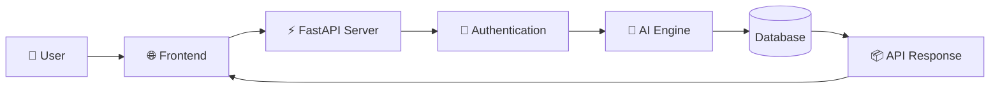
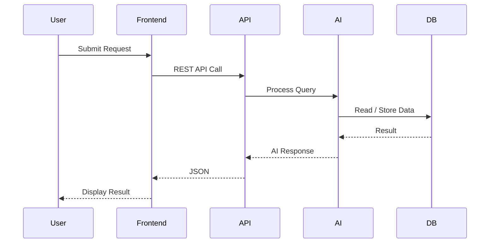
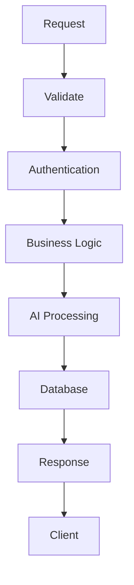

<div align="center">


# 🧠 Adversaria-AI Backend

### 🚀 AI-Powered Backend • FastAPI • Python • Secure • Scalable

<p align="center">


</p>


</div>

---

# 🏗 Backend Architecture



---

# ⚙ Request Lifecycle



---

# 📂 Backend Structure

```text
backend/
│
├── app/
│   ├── api/
│   ├── auth/
│   ├── models/
│   ├── services/
│   ├── routes/
│   ├── schemas/
│   ├── database/
│   ├── utils/
│   └── core/
│
├── uploads/
├── static/
├── requirements.txt
├── .env
├── main.py
└── README.md
```

---

# 🚀 Features

| Feature | Status |
|---------|--------|
| ⚡ FastAPI REST API | ✅ |
| 🔐 Authentication | ✅ |
| 🧠 AI Processing | ✅ |
| 📁 File Upload | ✅ |
| 📊 JSON Responses | ✅ |
| 📚 Swagger API Docs | ✅ |
| 🛡 Error Handling | ✅ |
| 🔄 Async Processing | ✅ |

---

# 🔄 API Workflow



---

# 📡 API Endpoints

| Method | Endpoint | Description |
|---------|----------|-------------|
| GET | `/` | Health Check |
| POST | `/predict` | AI Prediction |
| POST | `/analyze` | Analyze Input |
| POST | `/upload` | Upload File |
| GET | `/docs` | Swagger Documentation |
| GET | `/redoc` | ReDoc Documentation |

---

# 🛠 Installation

```bash
git clone https://github.com/kriss2012/Adversaria-AI.git

cd backend

python -m venv venv

source venv/bin/activate

# Windows
venv\Scripts\activate

pip install -r requirements.txt

uvicorn main:app --reload
```

---

# 🌐 API Documentation

After starting the server:

```
http://127.0.0.1:8000/docs
```

Swagger UI

```
http://127.0.0.1:8000/redoc
```

ReDoc Documentation

---

# 📦 Backend Pipeline

```text
Client
   │
   ▼
REST API
   │
   ▼
Authentication
   │
   ▼
Validation
   │
   ▼
AI Engine
   │
   ▼
Database
   │
   ▼
JSON Response
```

---

# 💻 Technology Stack

<div align="center">


</div>

---

# 📈 Backend Performance

| Capability | Support |
|------------|---------|
| Async API | ✅ |
| High Performance | ✅ |
| OpenAPI | ✅ |
| Scalable | ✅ |
| Modular | ✅ |
| Production Ready | ✅ |

---

<div align="center">

## ⭐ Star this repository if you found it useful!


</div>
